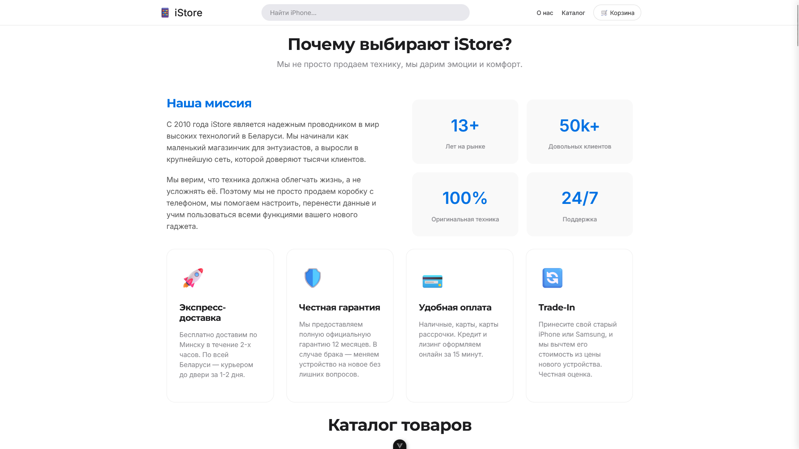
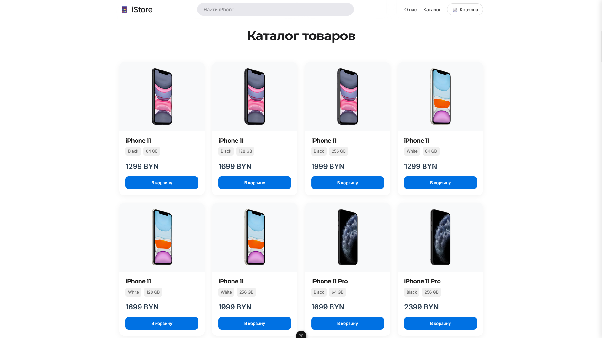
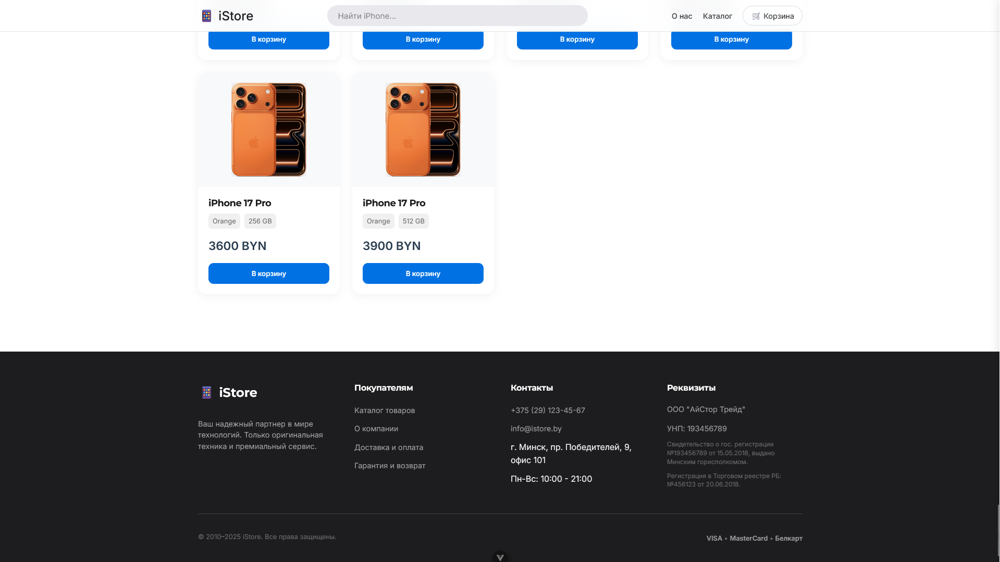
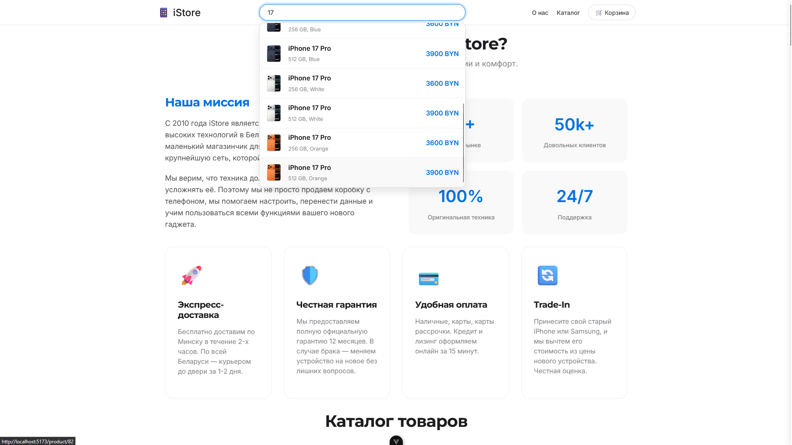
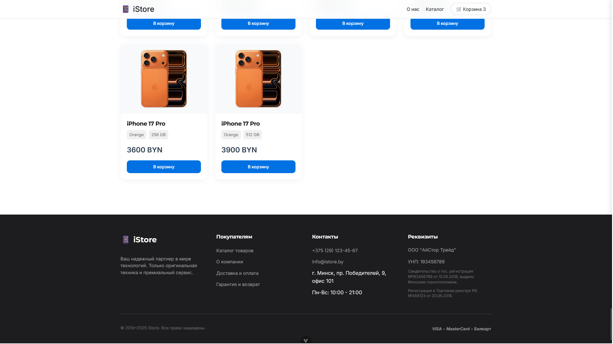
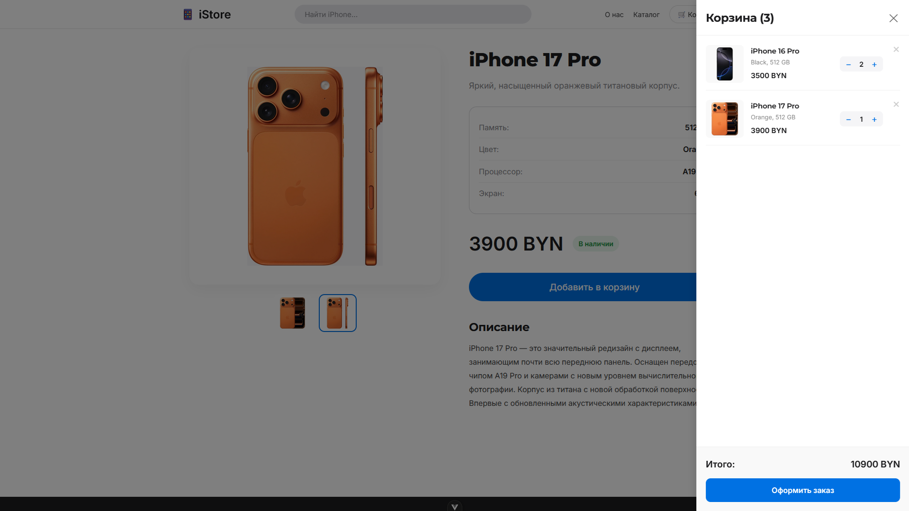

# 📱 iStore — Интернет-магазин смартфонов

Современный Fullstack интернет-магазин мобильной техники, разработанный в рамках курсовой работы. Проект представляет собой SPA (Single Page Application) с каталогом товаров, детальной страницей продукта, корзиной и оформлением заказа.

 
 
 
 
 
 

## 🚀 Технологический стек

### Frontend
*   **Vue.js 3** (Composition API) — реактивный интерфейс.
*   **Vite** — быстрая сборка проекта.
*   **Vue Router 4** — навигация и якорные ссылки (Landing Page style).
*   **Pinia** — управление состоянием (корзина, persistence в LocalStorage).
*   **Axios** — HTTP-клиент для запросов к API.
*   **CSS3** — адаптивная верстка, Flexbox/Grid, CSS Variables.

### Backend
*   **Node.js** — среда выполнения.
*   **Express.js** — веб-фреймворк для REST API.
*   **TypeScript** — типизация для надежности кода.
*   **mssql** — драйвер для работы с базой данных.

### Database
*   **Microsoft SQL Server** — реляционная база данных.
*   Хранение данных о товарах, моделях, цветах, изображениях и заказах.

---

## 🛠️ Функционал

*   **Каталог товаров:** Отображение списка смартфонов с фото, ценой и характеристиками.
*   **Страница товара:** Детальная информация, галерея изображений, выбор цвета (реализовано через отдельные товары).
*   **Поиск:** Поиск интересующего товара по названию.
*   **Корзина (Drawer):**
    *   Добавление/удаление товаров.
    *   Изменение количества.
    *   Автоматический подсчет суммы.
    *   Сохранение корзины при перезагрузке страницы.
    *   Проверка наличия товара на складе (Stock check).
*   **Оформление заказа:** Форма с валидацией, отправка заказа на сервер, списание товара со склада (транзакция).

---

## 📦 Установка и запуск

### Предварительные требования
*   Node.js (v16+)
*   Microsoft SQL Server (LocalDB или Docker)

### 1. Настройка Базы Данных
1.  Создайте базу данных `smartphone-iternet-store` в MS SQL Server.
2.  Выполните SQL-скрипты из папки `database/` (или из истории разработки) для создания таблиц и заполнения данными.

### 2. Запуск Backend
```bash
cd backend/node
# Установка зависимостей
npm install

# Создайте файл .env в папке backend/node:
# PORT=8080
# DB_SERVER=localhost
# DB_DATABASE=smartphone-iternet-store
# DB_USER=sa
# DB_PASSWORD=your_password

# Запуск сервера
npm start

# Сервер запустится на http://localhost:8080. 
```

### 3. Запуск Frontend
```bash
cd frontend
# Установка зависимостей
npm install

# Запуск в режиме разработки
npm run dev

# Приложение будет доступно по адресу http://localhost:5173. 
```

### Структура проекта
```bash
smartfone-internet-store/
├── backend/            # Серверная часть
│   └── node/
│       ├── src/
│       │   ├── controllers/  # Логика обработки запросов
│       │   ├── routes/       # Маршруты API
│       │   └── server.ts     # Точка входа
├── frontend/           # Клиентская часть
│   ├── src/
│   │   ├── assets/     # Стили (main.css)
│   │   ├── components/ # Vue компоненты (Header, ProductList, CartDrawer)
│   │   ├── services/   # API клиент (axios)
│   │   ├── stores/     # Pinia store (cart.js)
│   │   ├── views/      # Страницы (HomeView, ProductView, Checkout)
│   │   └── App.vue
└── README.md           # Описание проекта
```